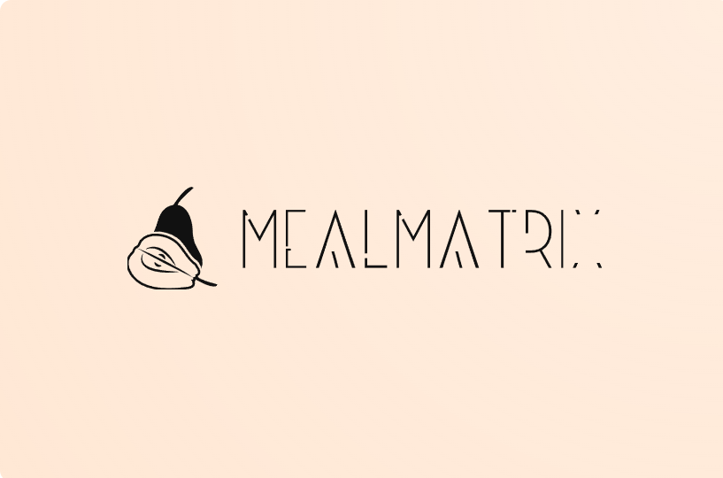
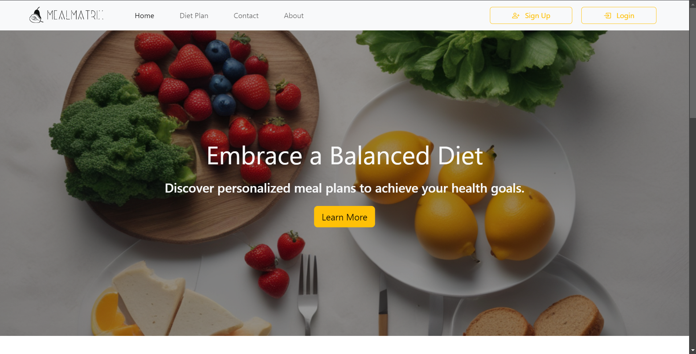
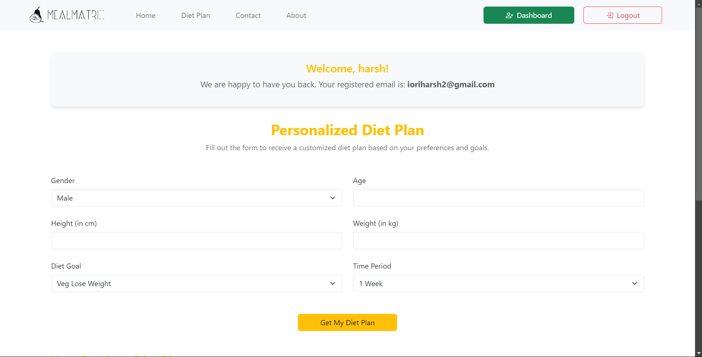
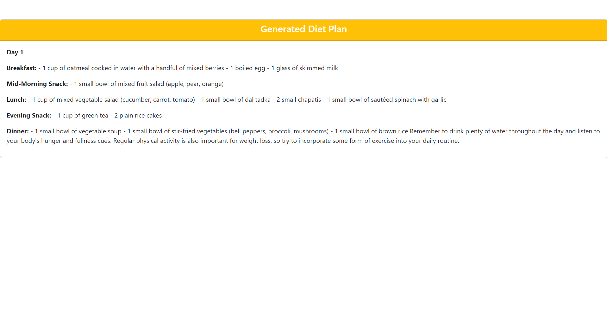

# MealMatrix - Personalized Diet Plan Generator




**MealMatrix** is a web application built with **Django** that generates personalized diet plans based on users' health goals. Whether you want to lose weight, gain muscle, or maintain your current weight, MealMatrix creates a diet plan customized to your age, weight, height, gender, and specific dietary goals.

This project is ideal for users who want a convenient way to create meal plans based on their health objectives.

---

## Table of Contents

- [Project Overview](#project-overview)
- [Features](#features)
- [Technologies Used](#technologies-used)
- [Usage](#usage)
- [Installation](#installation)
- [Screenshots](#screenshots)
- [Contributing](#contributing)
- [Acknowledgements](#acknowledgements)
- [Final Notes](#final-notes)

---

## Project Overview

**MealMatrix** empowers users to create personalized meal plans tailored to their fitness goals. By collecting important user information (such as age, height, weight, and specific diet goals), it generates a diet plan designed to help them reach their objectives. 

The app is designed to be intuitive and user-friendly, offering a simple form to gather the necessary information, and then presenting a diet plan that is easy to follow.

### Key Features

- **Personalized Diet Plans**: Users can generate a diet plan based on their gender, age, weight, height, and diet goal (e.g., weight loss, muscle gain, etc.).
- **Diet History**: Users can view their previously generated diet plans.
- **Customizable Goals**: Users can choose different goals, such as weight loss or muscle gain, with options for vegetarian and non-vegetarian preferences.
- **Mobile-friendly**: Built using **Bootstrap** for a responsive design that works seamlessly across devices.
- **User Authentication**: Secure registration, login, and user dashboard to manage diet plans.

---

## Features

- **Generate Personalized Diet Plans**: Input age, gender, weight, height, and diet goals to create tailored meal plans.
- **View History**: See your previous diet plans with all details including date created, goals, and other stats.
- **Diet Goals**: Choose from options like weight loss, muscle gain, or maintenance, with both vegetarian and non-vegetarian options.
- **User Profiles**: Register and log in to access your personalized dashboard and keep track of your diet plans.
- **Easy-to-use UI**: Simple form-based user interface with clear instructions.

---

## Technologies Used

This project was developed using the following technologies:

- **Django** (Python web framework)
- **SQLite** (Database for storing user and diet data)
- **Bootstrap 5** (Responsive CSS framework)
- **Font Awesome** (Icons for the interface)
- **HTML5** / **CSS3** (Frontend structure and styling)
- **Python 3.8+**

---

## Usage

Once the app is running, you can:

1. **Sign Up/Log In**: Create a new account or log in to an existing one.
2. **Dashboard**: Access the dashboard where you can create and manage your diet plans.
3. **Generate a Diet Plan**: 
   - Fill out the form with your personal details, including age, weight, height, gender, and diet goals (e.g., weight loss, muscle gain).
   - Click "Generate" to receive a customized diet plan.
4. **View Previous Diet Plans**: 
   - Check out your previous diet plans under your dashboard to track your progress.

---

## Installation

### Steps to Install

1. **Clone the repository**:
   ```bash
   git clone https://github.com/your-username/mealmatrix.git
   cd mealmatrix
   pip install openai
   py manage.py runserver
## Screenshots


### Example Screenshots

#### Home Page


#### Dashboard


#### Diet Plan Form



---

## Contributing

We welcome contributions to this project! If you'd like to contribute, please follow these steps:

1. **Fork the repository**.
2. **Create a new branch** for your feature or bug fix.
3. **Make changes** and ensure they are well-tested.
4. **Submit a pull request** with a detailed description of your changes.

### Code Style

- Follow **PEP 8** guidelines for Python code.
- Use **Django best practices** for writing views, models, and forms.


---

## Acknowledgements

- **Django**: For providing a robust and flexible web framework.
- **Bootstrap 5**: For creating a responsive design that works well across all devices.
- **Font Awesome**: For offering scalable vector icons that enhance the user experience.

---

## Final Notes

Feel free to ask any questions if you encounter issues or need help. We're happy to assist and collaborate!

---